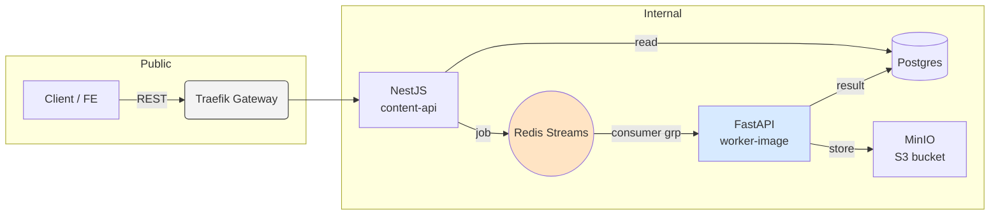

Mermaid source

```mermaid
flowchart LR;

    subgraph Public
        A[Client / FE] --REST--> GW(Traefik Gateway)
    end
    subgraph Internal
        GW --> API[NestJS<br>content-api]
        API --job--> RS((Redis Streams))
        RS -->|consumer grp| Worker[FastAPI<br>worker-image]
        Worker --result--> PG[(Postgres)]
        Worker --store--> S3[MinIO<br>S3 bucket]
        API --read--> PG
    end
    style GW fill:#f3f3f3,stroke:#333
    style RS fill:#ffe4c4
    style Worker fill:#d7eaff
```

